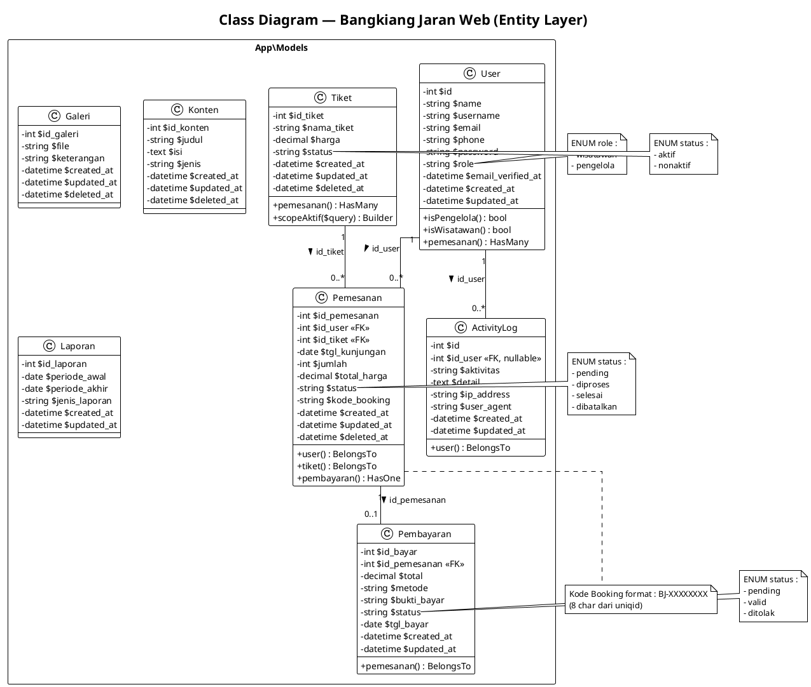

# Class Diagram - Bangkiang Jaran Web

## E-Tourism Waterfall Ticketing System (Laravel)

Berikut adalah class diagram untuk seluruh aplikasi Bangkiang Jaran Web.
Render di: https://www.plantuml.com/plantuml/uml/ atau VS Code PlantUML extension.

---

## 1. Entity / Model Layer



---

## 2. Controller Layer

```plantuml
@startuml controller-layer
!theme plain
skinparam classAttributeIconSize 0
skinparam packageStyle rectangle

title Class Diagram — Bangkiang Jaran Web (Controller Layer)

' ============================================================
' BASE CONTROLLER
' ============================================================

package "App\\Http\\Controllers" #EEEEEE {
    class Controller <<abstract>> {
        <<uses>> + AuthorizesRequests
        <<uses>> + DispatchesJobs
        <<uses>> + ValidatesRequests
    }

    class ProfileController {
        + edit(Request) : View
        + update(ProfileUpdateRequest) : RedirectResponse
        + destroy(Request) : RedirectResponse
    }
}

' ============================================================
' AUTH CONTROLLERS
' ============================================================

package "Auth Controllers" #E8F5E9 {
    class AuthenticatedSessionController {
        + create() : View
        + store(LoginRequest) : RedirectResponse
        + destroy(Request) : RedirectResponse
    }

    class RegisteredUserController {
        + create() : View
        + store(Request) : RedirectResponse
    }

    class ConfirmablePasswordController {
        + show() : View
        + store(Request) : RedirectResponse
    }

    class EmailVerificationPromptController {
        + show() : View
    }

    class EmailVerificationNotificationController {
        + store(Request) : RedirectResponse
    }

    class NewPasswordController {
        + create(Request) : View
        + store(Request) : RedirectResponse
    }

    class PasswordController {
        + update(Request) : RedirectResponse
    }

    class PasswordResetLinkController {
        + create() : View
        + store(Request) : RedirectResponse
    }

    class VerifyEmailController {
        + __invoke(Request) : RedirectResponse
    }
}

' ============================================================
' WISATAWAN CONTROLLERS
' ============================================================

package "Wisatawan Controllers" #E3F2FD {
    class "Wisatawan\\\\LandingController" as W_LandingController {
        + index() : View
    }

    class "Wisatawan\\\\TiketController" as W_TiketController {
        + index(Request) : View
        + detail(int) : View
    }

    class "Wisatawan\\\\PemesananController" as W_PemesananController {
        + create(Request) : View
        + store(Request) : RedirectResponse
        + sukses(int) : View
        + riwayat() : View
        + detailPemesanan(int) : View
    }

    class "Wisatawan\\\\PembayaranController" as W_PembayaranController {
        + create(int) : View
        + store(Request, int) : RedirectResponse
    }
}

' ============================================================
' PENGELOLA CONTROLLERS
' ============================================================

package "Pengelola Controllers" #FFF3E0 {
    class "Pengelola\\\\DashboardController" as P_DashboardController {
        + index() : View
    }

    class "Pengelola\\\\KontenController" as P_KontenController {
        + index() : View
        + create() : View
        + store(Request) : RedirectResponse
        + edit(int) : View
        + update(Request, int) : RedirectResponse
        + destroy(int) : RedirectResponse
    }

    class "Pengelola\\\\GaleriController" as P_GaleriController {
        + index() : View
        + create() : View
        + store(Request) : RedirectResponse
        + destroy(int) : RedirectResponse
    }

    class "Pengelola\\\\TiketController" as P_TiketController {
        + index() : View
        + create() : View
        + store(Request) : RedirectResponse
        + edit(int) : View
        + update(Request, int) : RedirectResponse
        + destroy(int) : RedirectResponse
    }

    class "Pengelola\\\\VerifikasiController" as P_VerifikasiController {
        + index() : View
        + show(int) : View
        + validasi(Request, int) : RedirectResponse
    }

    class "Pengelola\\\\LaporanController" as P_LaporanController {
        + index() : View
        + kunjungan(Request) : View|BinaryFileResponse
        + transaksi(Request) : View|BinaryFileResponse
    }

    class "Pengelola\\\\UserController" as P_UserController {
        + index(Request) : View
    }
}

' ============================================================
' INHERITANCE
' ============================================================

Controller <|-- ProfileController
Controller <|-- AuthenticatedSessionController
Controller <|-- RegisteredUserController
Controller <|-- ConfirmablePasswordController
Controller <|-- EmailVerificationPromptController
Controller <|-- EmailVerificationNotificationController
Controller <|-- NewPasswordController
Controller <|-- PasswordController
Controller <|-- PasswordResetLinkController
Controller <|-- VerifyEmailController
Controller <|-- W_LandingController
Controller <|-- W_TiketController
Controller <|-- W_PemesananController
Controller <|-- W_PembayaranController
Controller <|-- P_DashboardController
Controller <|-- P_KontenController
Controller <|-- P_GaleriController
Controller <|-- P_TiketController
Controller <|-- P_VerifikasiController
Controller <|-- P_LaporanController
Controller <|-- P_UserController

@enduml
```



---

## 3. Full Architecture Diagram (All Layers)

```plantuml
@startuml full-architecture
!theme plain
skinparam classAttributeIconSize 0
skinparam packageStyle rectangle
skinparam linetype ortho

title Full Architecture — Bangkiang Jaran Web

' ============================================================
' HELPER
' ============================================================

package "App\\Helpers" #F3E5F5 {
    class ActivityLogger <<utility>> {
        + {static} log(string $aktivitas, string $detail = null, int $id_user = null) : void
    }
}

' ============================================================
' MAIL
' ============================================================

package "App\\Mail" #FCE4EC {
    class WelcomeMail {
        - User $user
        --
        + __construct(User $user)
        + build() : Mailable
    }

    class PemesananBerhasil {
        - Pemesanan $pemesanan
        --
        + __construct(Pemesanan $pemesanan)
        + build() : Mailable
    }

    class PembayaranValid {
        - Pemesanan $pemesanan
        --
        + __construct(Pemesanan $pemesanan)
        + build() : Mailable
    }

    class PembayaranDitolak {
        - Pemesanan $pemesanan
        --
        + __construct(Pemesanan $pemesanan)
        + build() : Mailable
    }
}

' ============================================================
' FORM REQUESTS
' ============================================================

package "App\\Http\\Requests" #E0F7FA {
    class LoginRequest {
        + authenticate() : void
    }

    class ProfileUpdateRequest {
        + rules() : array
    }
}

' ============================================================
' MODELS
' ============================================================

package "App\\Models" #FFFDE7 {
    class User {
        - int $id
        - string $name
        - string $username
        - string $email
        - string $phone
        - string $password
        - string $role
        --
        + isPengelola() : bool
        + isWisatawan() : bool
        + pemesanan() : HasMany
    }

    class Tiket {
        - int $id_tiket
        - string $nama_tiket
        - decimal $harga
        - string $status
        --
        + pemesanan() : HasMany
        + scopeAktif($query) : Builder
    }

    class Pemesanan {
        - int $id_pemesanan
        - int $id_user
        - int $id_tiket
        - date $tgl_kunjungan
        - int $jumlah
        - decimal $total_harga
        - string $status
        - string $kode_booking
        --
        + user() : BelongsTo
        + tiket() : BelongsTo
        + pembayaran() : HasOne
    }

    class Pembayaran {
        - int $id_bayar
        - int $id_pemesanan
        - decimal $total
        - string $metode
        - string $bukti_bayar
        - string $status
        - date $tgl_bayar
        --
        + pemesanan() : BelongsTo
    }

    class Galeri {
        - int $id_galeri
        - string $file
        - string $keterangan
    }

    class Konten {
        - int $id_konten
        - string $judul
        - text $isi
        - string $jenis
    }

    class Laporan {
        - int $id_laporan
        - date $periode_awal
        - date $periode_akhir
        - string $jenis_laporan
    }

    class ActivityLog {
        - int $id
        - int $id_user
        - string $aktivitas
        - text $detail
        - string $ip_address
        - string $user_agent
        --
        + user() : BelongsTo
    }
}

' ============================================================
' MIDDLEWARE
' ============================================================

package "App\\Http\\Middleware" #EFEBE9 {
    class CheckRole {
        + handle(Request, Closure, ...string $roles) : mixed
    }

    class Localization {
        + handle(Request, Closure) : mixed
    }
}

' ============================================================
' CONTROLLERS
' ============================================================

package "Controllers" #F5F5F5 {
    class Controller <<abstract>>
    class ProfileController
    class AuthenticatedSessionController
    class RegisteredUserController

    class "Wisatawan\\\\LandingController" as WLC
    class "Wisatawan\\\\TiketController" as WTC
    class "Wisatawan\\\\PemesananController" as WPC
    class "Wisatawan\\\\PembayaranController" as WPBC

    class "Pengelola\\\\DashboardController" as PDC
    class "Pengelola\\\\KontenController" as PKC
    class "Pengelola\\\\GaleriController" as PGC
    class "Pengelola\\\\TiketController" as PTC
    class "Pengelola\\\\VerifikasiController" as PVC
    class "Pengelola\\\\LaporanController" as PLC
    class "Pengelola\\\\UserController" as PUC
}

' ============================================================
' RELATIONSHIPS — MODELS
' ============================================================

User "1" -- "0..*" Pemesanan
Tiket "1" -- "0..*" Pemesanan
Pemesanan "1" -- "0..1" Pembayaran
User "1" -- "0..*" ActivityLog

' ============================================================
' RELATIONSHIPS — CONTROLLERS USE MODELS
' ============================================================

WLC ..> Konten : uses
WLC ..> Galeri : uses
WLC ..> Tiket : uses
WTC ..> Tiket : uses
WPC ..> Tiket : uses
WPC ..> Pemesanan : uses
WPBC ..> Pemesanan : uses
WPBC ..> Pembayaran : uses

PDC ..> Pemesanan : uses
PDC ..> Pembayaran : uses
PDC ..> User : uses
PKC ..> Konten : uses
PGC ..> Galeri : uses
PTC ..> Tiket : uses
PVC ..> Pemesanan : uses
PVC ..> Pembayaran : uses
PLC ..> Pemesanan : uses
PLC ..> Pembayaran : uses
PUC ..> User : uses

' ============================================================
' RELATIONSHIPS — CONTROLLERS USE OTHER CLASSES
' ============================================================

AuthenticatedSessionController ..> LoginRequest : validates
AuthenticatedSessionController ..> ActivityLogger : logs
RegisteredUserController ..> ActivityLogger : logs
RegisteredUserController ..> WelcomeMail : sends
W_PemesananController ..> PemesananBerhasil : sends
PVC ..> PembayaranValid : sends
PVC ..> PembayaranDitolak : sends
PKC ..> ActivityLogger : logs
PGC ..> ActivityLogger : logs
PTC ..> ActivityLogger : logs
PVC ..> ActivityLogger : logs

' ============================================================
' INHERITANCE
' ============================================================

Controller <|-- ProfileController
Controller <|-- AuthenticatedSessionController
Controller <|-- RegisteredUserController
Controller <|-- WLC
Controller <|-- WTC
Controller <|-- WPC
Controller <|-- WPBC
Controller <|-- PDC
Controller <|-- PKC
Controller <|-- PGC
Controller <|-- PTC
Controller <|-- PVC
Controller <|-- PLC
Controller <|-- PUC

@enduml
```



---

## Ringkasan Arsitektur

| Layer | Jumlah Class | Keterangan |
|---|---|---|
| **Models** | 8 | User, Pemesanan, Tiket, Pembayaran, Galeri, Konten, Laporan, ActivityLog |
| **Controllers (Auth)** | 9 | Login, Register, Password Reset, Email Verify |
| **Controllers (Wisatawan)** | 4 | Landing, Tiket, Pemesanan, Pembayaran |
| **Controllers (Pengelola)** | 7 | Dashboard, Konten, Galeri, Tiket, Verifikasi, Laporan, User |
| **Controllers (Base)** | 2 | Controller (abstract), ProfileController |
| **Middleware** | 2 | CheckRole, Localization |
| **Mail** | 4 | WelcomeMail, PemesananBerhasil, PembayaranValid, PembayaranDitolak |
| **Form Request** | 2 | LoginRequest, ProfileUpdateRequest |
| **Helper** | 1 | ActivityLogger (static utility) |
| **Total** | **39** | |

### Relasi Model (ER)

```
User 1 ──── * Pemesanan
Tiket 1 ──── * Pemesanan
Pemesanan 1 ──── 0..1 Pembayaran
User 1 ──── * ActivityLog
```

### Flow Bisnis Utama

```
Wisatawan Register → Login → Pilih Tiket → Buat Pemesanan → Upload Pembayaran → Menunggu Verifikasi
                                                                                      ↓
Pengelola ← Dashboard ← Lihat Statistik ← Verifikasi Pembayaran ← Kirim Email Notifikasi
```

### Cara Render Diagram

1. **Online:** Buka https://www.plantuml.com/plantuml/uml/ , paste kode `@startuml ... @enduml`
2. **VS Code:** Install extension **PlantUML**, buka file `.puml`, tekan `Alt+D`
3. **CLI:** `java -jar plantuml.jar CLASS_DIAGRAM.md`
